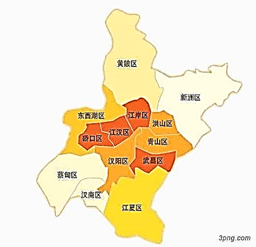

🍳【地理】湖北 上海 广州 深圳

- [湖北](# 湖北)
- [上海](# 上海)
- [深圳](# 深圳)

# 湖北

**中心城区(7个)：**

武昌区、青山区、洪山区、江岸区、江汉区、硚口区、汉阳区

**新城区(6个)：**

汉南区、蔡甸区、东西湖区、黄陂区、新洲区、江夏区

**功能区(4个)：**

光谷，武汉东湖高新开发区; 沌口，武汉经开区、临空区、长江新城

[行政区划十六湖北省](https://mp.weixin.qq.com/s/CRwHRSqd8z45-SO7c5lhHA)

[武汉市各区有什么特点](http://www.wuhan.com/travel/21798.html)

[知乎：武汉市各区有什么特点？](https://www.zhihu.com/question/328260217)

 

# 上海

 

 

# 深圳

