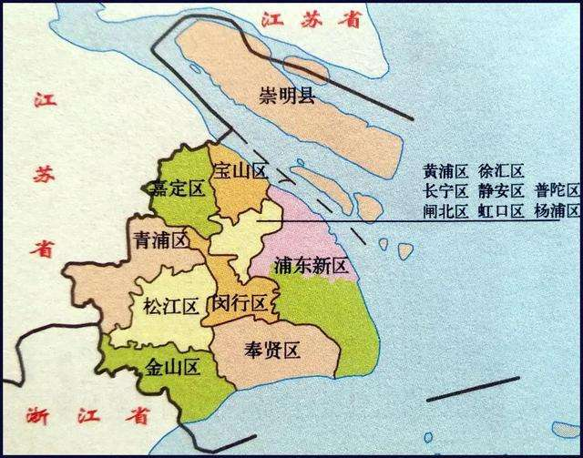

# 上海

## 上海市地图

 

## 上海市行政区划

简称沪，又称申，俗称魔都，区号021。

邮政编码前两位20，身份证号前两位31。

面积6340.5平方公里，人口2423.78万（2018年底）。

车牌代码沪A、沪B、沪C、沪D、沪E、沪F、沪G、沪H、沪J、沪K、沪L、沪M、沪N。

共有16个县级行政区划单位（16区）。

**中心城区7区**

黄浦区  徐汇区  长宁区  静安区  普陀区  虹口区  杨浦区

**郊区9区**

闵行区  宝山区  嘉定区  金山区  松江区  青浦区  奉贤区  崇明区  浦东新区

**机场**

上海浦东、上海虹桥2个商业机场。

上海龙华直升机场、上海高东直升机场、上海国际赛车场直升机场、上海金桥直升机场、上海化学工业区医疗中心高架直升机场、上海金山水上机场等共6个持证通用机场。

**火车站**

上海站、上海南站、上海西站、上海虹桥站、松江南站、金山北站、安亭北站、南翔北站等。