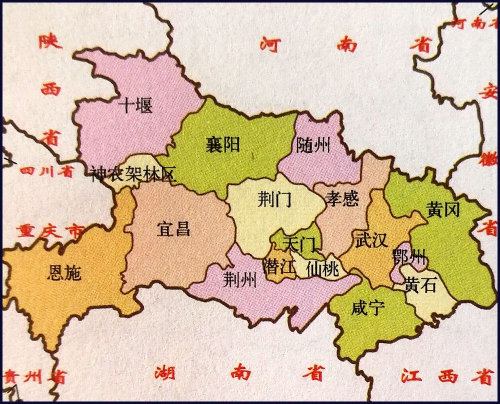
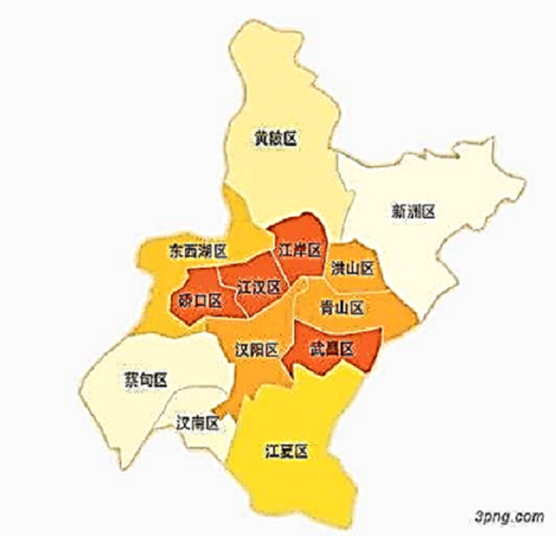
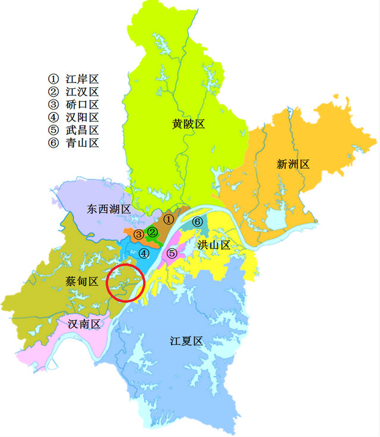

# 湖北

👇以下内容来自博主：[@CARLOSGP2021](https://github.com/CARLOSGP2021)

## 湖北省地图

## 湖北省行政区划

  湖北省，简称鄂。

  邮政编码前两位43/44，身份证号前两位42。

  面积18.59万平方公里，人口5917万（2018年底）。

  辖武汉、黄石、黄冈、孝感、荆州、荆门、襄阳、十堰、宜昌、鄂州、咸宁、随州12个地级市，恩施土家族苗族自治州1个自治州，仙桃、潜江、天门3个省直辖市，神农架林区1个林区。省会武汉市。

  103个县级行政区划单位（其中：39个市辖区、25个县级市、36个县、2个自治县、1个林区）。

  武汉天河、襄阳刘集、十堰武当山、宜昌三峡、恩施许家坪、神农架共6个商业机场。还有在建的荆州沙市机场和鄂州机场。

  武汉汉南、武汉亚心总医院高架直升机场、荆门漳河、随州厉山、仙桃机场共5个持证通用机场。

**武汉市** 

区号027，车牌鄂A，辖13区。

区：江岸区 武昌区 江汉区 硚口区 汉阳区 青山区 洪山区 江夏区 黄陂区 新洲区 蔡甸区 东西湖区 汉南区　

**襄阳市** 

区号0710，车牌鄂F， 辖3区3县级市3县。

区：襄城区　 樊城区　 襄州区 

市：老河口市　 枣阳市　 宜城市

县：南漳县　 谷城县　 保康县

**鄂州市** 

区号0711，车牌鄂G， 辖3区。

区：鄂城区　 华容区　 梁子湖区

**孝感市** 

区号0712，车牌鄂K，辖1区3县级市3县。

区：孝南区 

市：应城市　 安陆市　 汉川市

县：云梦县　 大悟县　 孝昌县

**黄冈市** 

区号0713，车牌鄂J，辖1区2县级市7县。 

区：黄州区 

市：麻城市　 武穴市

县：红安县 罗田县 浠水县 蕲春县 黄梅县 英山县 团风县

**黄石市** 

区号0714，车牌鄂B，辖4区1县级市1县。 

区：黄石港区 西塞山区 下陆区 铁山区 

市：大冶市

县：阳新县

**咸宁市** 

区号0715，车牌鄂L，辖1区1县级市4县。 

区：咸安区 

市：赤壁市

县：嘉鱼县 通山县 崇阳县 通城县

**荆州市** 

区号0716，车牌鄂D，辖2区3县级市3县。

区：沙市区 　荆州区 

市：洪湖市　 石首市　 松滋市

县：监利县　 公安县　 江陵县

**宜昌市** 

区号0717，车牌鄂E，辖5区3县级市3县2自治县。 

区：西陵区 伍家岗区 点军区 猇亭区 夷陵区 

市：宜都市　 当阳市　 枝江市

县：秭归县　 远安县　 兴山县 

自治县：五峰土家族自治县 长阳土家族自治县

**恩施土家族苗族自治州** 

区号0718，车牌鄂Q，辖2县级市6县。 

市：恩施市　 利川市 

县：建始县 来凤县 巴东县 鹤峰县 宣恩县 咸丰县

**十堰市** 

区号0719， 车牌鄂C，辖3区1县级市4县。

区：张湾区 　茅箭区 郧阳区

市：丹江口市

县：竹山县　 房县 郧西县　 竹溪县

**随州市** 

区号0722， 车牌鄂S，辖1区1县级市1县。

区：曾都区 

市：广水市

县：随县

**荆门市** 

区号0724，车牌鄂H，辖2区2县级市1县。 

区：东宝区　 掇刀区 　

市：钟祥市  京山市

县：沙洋县

**省直辖行政地区** 

辖3县级市1林区。

市：仙桃市 区号0728 ，车牌鄂M

​    潜江市 区号0728 ，车牌鄂N

​    天门市 区号0728 ，车牌鄂R

林区：神农架林区 区号0719 ，车牌鄂P

## 武汉市介绍

[武汉市各区有什么特点](http://www.wuhan.com/travel/21798.html)

[知乎：武汉市各区有什么特点？](https://www.zhihu.com/question/328260217)

**中心城区(7个)：**

武昌区、青山区、洪山区、江岸区、江汉区、硚口区、汉阳区

**新城区(6个)：**

汉南区、蔡甸区、东西湖区、黄陂区、新洲区、江夏区

**功能区(4个)：**

光谷，武汉东湖高新开发区; 沌口，武汉经开区、临空区、长江新城

- 👇🏻武汉地铁线路图

 ## 武汉买房经验

[2021 武汉购房经验 (gitee.io)](https://tiancixiong.gitee.io/wuhan_house_experience_2021/#/)
